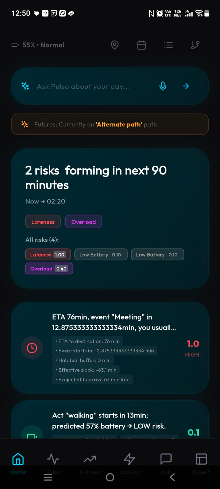
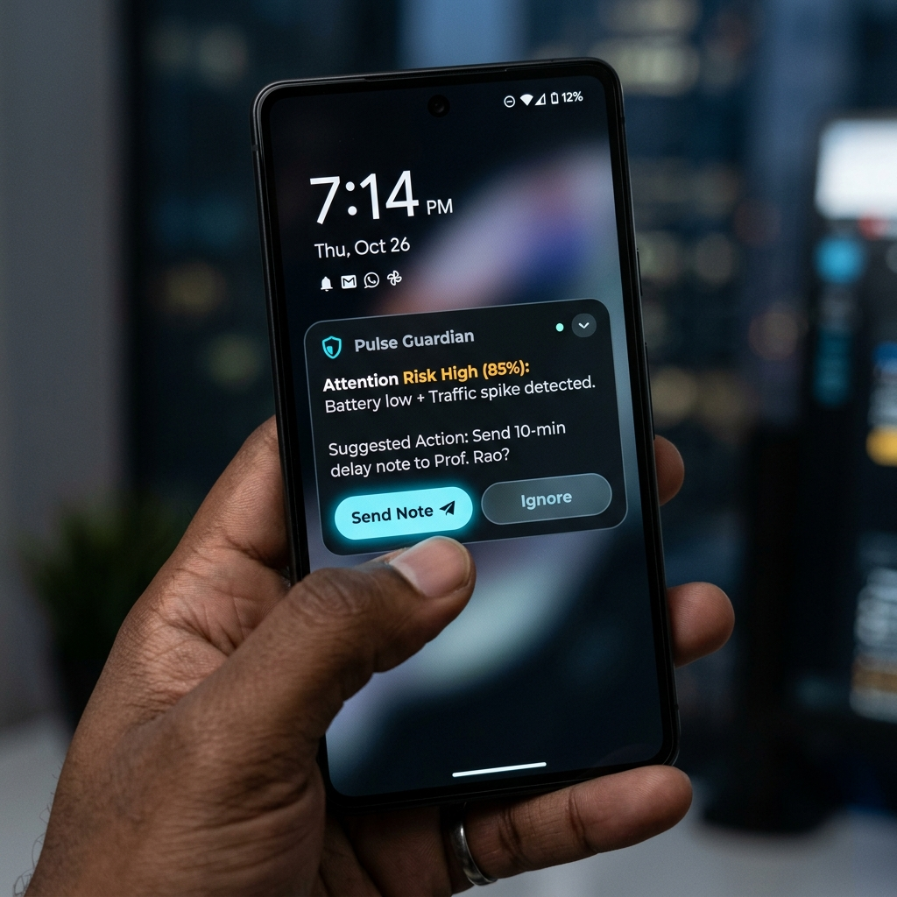

# Pulse: Proactive Digital Twin for Execution Intelligence

**Your attention, protected. Your execution, optimized.**

Pulse is an autonomous AI system that predicts when you'll fail—and intervenes before you do. Built on the **OpenClaw Agentic Framework**, it runs a continuous 180-second heartbeat that monitors your context, simulates your future, and protects you from invisible collisions.

<p align="center">
  
</p>

---

## 🏆 Built for Samsung Prism 2026

**Problem**: Your calendar knows WHEN. Your phone knows WHERE. But nothing protects you from the chaos in between.

**Solution**: Five autonomous agents working 24/7 to keep you on track when life doesn't.

---

## ⚡ The Agentic Edge: What Makes Pulse Different

### **1. Event-Driven Heartbeat Orchestration**
Most AI assistants wait for you to ask. Pulse runs autonomously every **180 seconds**, re-evaluating your trajectory without manual input. If it detects a collision (traffic spike + low battery + upcoming meeting), it intervenes immediately.

### **2. 5-Agent Neural Swarm**
Not a monolithic chatbot—a coordinated swarm of specialized agents:
- **Context Agent**: Normalizes multi-modal signals (GPS, battery, calendar, app usage)
- **Memory Agent**: Retrieves behavioral patterns from your digital twin graph
- **Risk Agent**: Calculates 0-100 failure probability scores
- **Planner Agent**: Simulates multiple futures to find the optimal path
- **Guardian Agent**: Decides intervention level (notify vs. auto-act)

### **3. Self-Evolving Digital Twin**
Your identity as a **living graph** (Neo4j). Pulse learns your commute buffers, battery habits, and schedule deviations. Every night, the Memory Agent runs a **self-reflection cycle** that updates your twin's preferences autonomously.

---

## 🛡️ Novel Features

| Feature | Innovation |
|---|---|
| **Futures Engine** | Simulates your next 4 hours to detect invisible collisions before they occur |
| **Guardian Interventions** | Doomscroll prevention, adaptive app shielding, auto-drafted "I'll be late" messages |
| **Context-Aware ETA** | OSRM routing + personal buffer preferences for realistic arrival times |
| **Privacy-First** | All context signals processed on-device; no cloud surveillance |
| **Full Auditability** | Every agent decision logged in `heartbeat_audit` trail |

<p align="center">
  
</p>

---

## 🏗️ Technical Architecture

**Backend**: Node.js/TypeScript (Fastify)  
**Intelligence**: OpenClaw Framework (Agentic Orchestration)  
**Mobile**: Flutter 3.11+ (Cross-platform)  
**Data**: PostgreSQL (Persistence) + Neo4j (Graph) + JSON (Agent Memory)  
**Geo**: OSRM (Routing) + Geolocator  
**Sync**: WebSocket (100ms latency)

**Critical Dependencies**:
- `battery_plus`, `geolocator`, `flutter_notification_listener`
- `web_socket_channel`, `http`, `shared_preferences`

---

## 📦 Download & Demo

### **Android APK (v1.0.0)**
🔗 **[Download Pulse.apk](https://drive.google.com/drive/u/1/folders/19EpEm6bIesJsUDiGa_PZQRafDZ5rwtFW)**

**Requirements**:
- Android 5.0+ (API 21)
- Location, Battery, Notification permissions

---

## 🎬 Demo: The "Commute Rescue" Scenario

**Situation**: 1:30 PM meeting. You're 1hr 47min away. Battery at 7%. Still scrolling Instagram.

**12:00 PM** → Context Agent detects: Low battery + impossible distance + app distraction  
**12:01 PM** → Risk Agent scores: 78/100 failure probability  
**12:02 PM** → Futures Engine predicts: Arrive 1:48 PM with dead phone  
**12:02 PM** → Guardian triggers: Charge alert + doomscroll shield + auto-drafted delay message  
**12:05 PM** → User taps "Send," plugs in, leaves early  
**1:28 PM** → Arrives on time with 45% battery. Memory Agent logs success.

**Result**: Proactive prevention instead of reactive damage control.

---

## 🚀 Quick Start

### **1. Clone & Install**
```bash
git clone https://github.com/your-username/pulse.git
cd pulse
flutter pub get
```

### **2. Run Backend**
```bash
cd backend
npm install
npm run dev
```

### **3. Launch App**
```bash
flutter run
```

### **4. Build APK**
```bash
flutter build apk --release --split-per-abi
# Output: build/app/outputs/flutter-apk/app-arm64-v8a-release.apk
```

---

## 📊 Impact Metrics

- **180-second heartbeat**: Continuous autonomous monitoring
- **5 specialized agents**: Multi-modal parallel reasoning
- **0-100 risk scores**: Quantified failure prediction
- **100ms sync latency**: Real-time mobile ↔ backend communication
- **Privacy-first**: On-device signal processing, no external tracking

---

## 🧠 Why This Matters

In Bengaluru, the average professional loses **2.3 hours per week** to preventable failures—missed meetings, dead phones, underestimated commutes. Pulse doesn't just schedule time. It **protects execution**.

Traditional calendars are reactive. Pulse is **predictive**.  
Traditional assistants wait for prompts. Pulse has a **heartbeat**.  
Traditional apps forget. Pulse has a **digital twin**.

---

## 👥 Team

Built by students from RVCE for Samsung Prism Openclaw hackathon 2026.

**Tech Stack**: Flutter • Node.js • OpenClaw • Neo4j • PostgreSQL • OSRM

---

## 📄 License

MIT License - Built for Samsung Prism Hackathon 2026

---

**Pulse**: *Because in the age of distraction, attention is the only asset that matters.*
